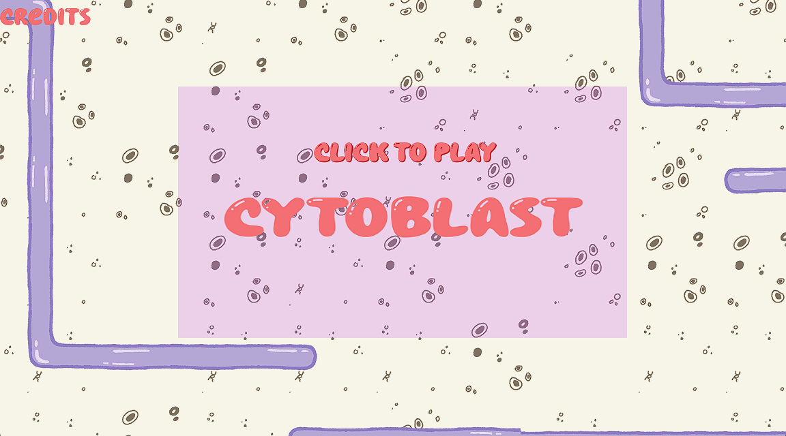
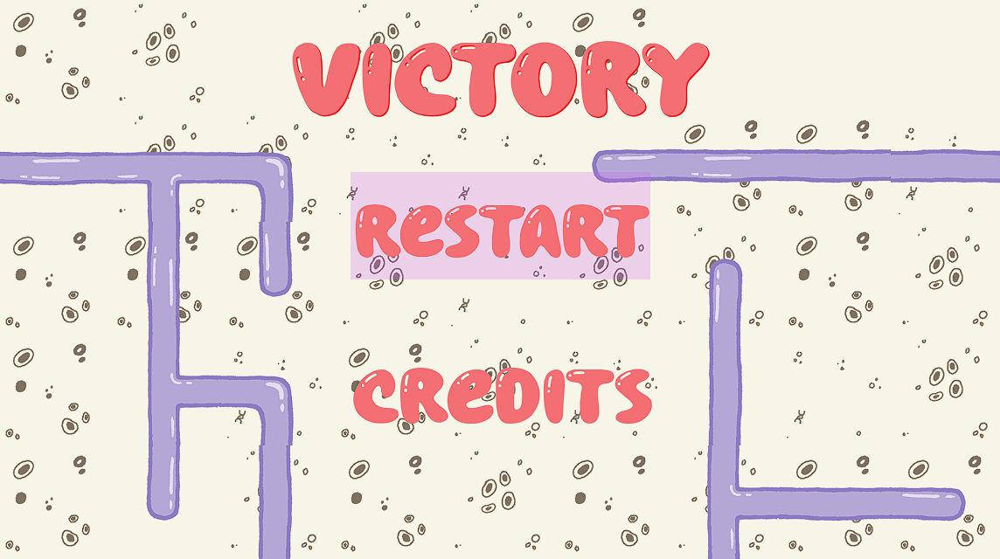
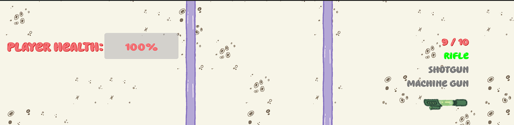

# Cytoblast #

## Summary ##

Dive into the microscopic battlefield of Cytoblast, a high-octane top-down shooter that puts you on the frontlines of cellular warfare! As a microscopic defender, you'll wield an arsenal of specialized weapons - from antiviral rifles to antibiotic machine guns - as you battle against an infection of hostile microorganisms. Dash through a maze of cellular chambers, strategically switching between weapons to counter different pathogenic threats. Face off against tactical virus turrets, aggressive bacteria, and stealthy parasitic biters while clearing room after room of escalating challenges. With fluid combat mechanics, strategic weapon management, and the ability to throw your weapons as a last resort, Cytoblast offers an intense, action-packed experience where every decision could mean the difference between cellular salvation and microscopic mayhem. Will you be the antibody this organism needs?

## Project Resources

[Web-playable version of your game.](https://itch.io/)  
[Trailor](https://youtube.com)  
[Press Kit](https://dopresskit.com/)  
[Proposal](https://docs.google.com/document/d/1MSlS52ui7cZe5zUArDbUQV3-Qev-chPhb2aMK8_9N7w/edit?usp=sharing) 
[Font](https://www.1001fonts.com/chewy-bubble-font.html)

## Gameplay Explanation ##

The game uses keyboard and mouse input for controls.
* WASD - Character movement
* Left Click - Attack
* Right Click - Throw Weapon
* Scroll Wheel - Switch Weapon
* Shift - Dash
* If the current level is too difficult, you can take the ‘L’ and skip to the next level

### Optimal Gameplay Strategy
The game has various levels of strategy for optimizing your gameplay. At the surface level is the type strength and weakness system. Using the proper weapon damage type against enemies will allow you to do more damage. However, there are also different weapon types, such as the rifle, machine gun, and shotgun. On top of the damage type system, you also want to use the correct weapon for the given situation. For example, if there are multiple enemies in front of you, you might want to switch to a shotgun. You can also throw your weapon for big damage. Optimal play will involve constant switching between weapons and choosing the right time to throw them. Enemies drop a lot of weapons so no need to get too attached to your weapons. Staying near walls to use as cover is also a good idea.

You can also use the dash to close distance between enemies and dodge attacks, as it grants you immunity to attacks during the dash. 

# External Code, Ideas, and Structure #

[Inspiration for smooth floating weapon drops](https://www.youtube.com/watch?v=3ZXrUhoBbUI&t=68s)

# Main Roles #

## Producer - Casey Downing

*Communication* - All communication was done through a Discord server. We had a single main chat with threads for each feature being worked on.

*Task Delegation* - To delegate tasks I kept things simple and created Discord threads for each feature that needed to be implemented. This meant we could keep discussions for features contained in one place. Inside the thread, I would describe the feature that needed to be added and then ping the team member responsible for implementing it.

*Git Workflow* - For every feature we implemented, we created new branches in the git repository that were based on the development branch. Once a feature was complete, we would create a pull request. As the producer, I would test the feature and fix any merge conflicts or sometimes bugs for critical features. Once I felt the feature was ready, I would merge the feature into the development branch. After the branch was merged, I would delete that branch to reduce the clutter.

### Logistics Problems
*Code Style* - Towards the end of development, the code style was not consistent. I thought we would all be following the same code style guidelines from Godot but that ended up not being the case. Even with the code style guide, people have different preferences that resulted in the code style varying in different areas. For example, the code style guide recommends using plain english, such as “and,” “or,” and “not,” for boolean operators but some of us used the traditional operators (I myself am guilty of this). I took responsibility for not establishing strict style guides sooner and I went through the code and fixed the inconsistencies myself.

### Templates and Design
As the producer, I was responsible for the game design. To ensure everyone was on the same page, I created base classes for features that needed to be further developed.

*Test Levels* - Added two test levels with a basic tileset that had collision. This was important for testing player movement and level switching. They were then deleted in favor of the actual levels. [Commit for test levels](https://github.com/cqdowning/cytoblast/commit/32fd5fb390c1da6cdbb137b5f64c261a54b865b7)

*Weapon Base Class* - Added a base class for weapons. There are functions for activating, deactivating, and shooting the weapon among a few other helpers. The shoot function was designed to be overridden and replaced with each weapon’s unique firing pattern. However, the base class handles the timing for when the shoot function is called on each weapon. [Weapon Base Class](https://github.com/cqdowning/cytoblast/blob/main/scripts/weapons/weapon_base.gd) 

*Enemy Base Class* - Added a base class for enemies. Enemies could be one of three types: bacteria, parasite, or virus. The base class was designed with an abstract ai function that was meant to be used to implement movement. Later we expanded the class with helper functions as well as the ability for enemies to do contact damage. The base class also handles enemy attack timing. [Enemy Base Class](https://github.com/cqdowning/cytoblast/blob/main/scripts/enemies/enemy_base.gd) 

*Level Design* - I designed all three levels. The basic level design is as follows: 
* Have an easy to defeat enemy at the start to give the player their first weapon
* Use unique layouts and enemy compositions
* Have around 5 rooms per level
* Levels should get progressively more difficult

The first level was what was used in our demo. The main problem with level design was that the difficulty of the demo level varied a lot with playtesters. Players more experienced with the genre felt it was too easy while other players struggled to get past the first enemy. I decided to make the first enemies of the levels all take one hit to defeat. In the end, level 1 went mostly unchanged after the demo since I felt it had a decent base line difficulty. 

Level 2 increases the difficulty level and has some more interesting room layouts. I tried to keep room sizes smaller and I increased the enemy density so that all enemies felt threatening. 

Level 3 is the last level so I wanted to make it feel more like a final gauntlet. Level 3 only has a few rooms but they are larger with many enemies and fewer walls to hide behind. I tried to make the final room interesting by having it progressively open up with more enemies spawning each time.

### Additional Features

Throwable Weapons - This was a more advanced feature so I wanted to handle it. We needed a way to discard the player’s weapon and I thought it would be interesting if you could throw it for big damage. This solved our weapon discard problem and it gives a risk/reward decision for the player to make. After throwing the weapon, it is discarded and the weapon creates an explosion projectile on collision with an effect that fades out. The projectile grabs the sprite off of the weapon that was thrown so that I didn’t have to create a version for all nine weapons.
[Thrown Projectile Class](https://github.com/cqdowning/cytoblast/blob/main/scripts/projectiles/projectile_player_thrown_weapon.gd) 

## User Interface and Input - Quinn Broderick

*Main Menu* - The main menu has two primary buttons, the bigger of the two is the “Click to Play, CYTOBLAST” button that starts the game as soon as it's pressed. The other is the smaller credits button that will take you to the list of the game makers’ names and roles. Both buttons will be shadowed by a faint pink rectangle when hovered over; the opacity and color of the rectangular trace were written into each of the scripts associated with the buttons and were defined in the _ready() functions. This feature is supposed to let the user know which are clickable elements on the main menu. The background was also designed using our gameplay tileset. I used the get_tree().change_scene_to_file() in the _on_pressed() functions (linked via the node signals) for the buttons so that there would be an immediate transition to either the first level scene or the associated credits scene. [Start button script](https://github.com/cqdowning/cytoblast/blob/d74ae23a263a4d752c9cb22bdbe0607864586f93/scripts/start_button.gd#L1) 

*Credits* - The credits screen contains the team’s names and roles using the same theme as the Main Menu (tileset, font, font colors, hovering background for buttons) but only contains an exit button in the top right corner that, when pressed, returns the user to the Main Menu. It uses a script very similar to the Main Menu. [Exit credits script](https://github.com/cqdowning/cytoblast/blob/d74ae23a263a4d752c9cb22bdbe0607864586f93/scripts/exit_credits.gd#L1) 

*End Screen* - The end screen is done in a very similar style as the Main Menu: the user has two button options, either view the credits or restart the game. The buttons are done in an almost identical fashion as described in the Main Menu section, a faint pink rectangular background appears when hovered to indicate it’s interactable. This scene can only be reached after the game has been completed successfully. The restart button also implements the get_tree().change_scene_to_file() function to jump cut right back to the first level when pressed. The credit scene is the same as described before. [Restart button](https://github.com/cqdowning/cytoblast/blob/d74ae23a263a4d752c9cb22bdbe0607864586f93/scripts/restart_button.gd#L1)

**Heads-up Display:**

*Health Bar* - The top left corner of the screen shows the player’s health bar, which is a progress bar linked to a signal from the player.gd script letting the hud.gd script know when the player’s health has been changed. I used Godot’s theme overrides to match the font and style to the theme used throughout our game to maintain the aesthetic; the progress bar reads “PLAYER HEALTH: “ and then displays the progress bar containing the player's current life percentage left. 

*Ammunition* - In the top right corner, there is an ammunition readout for the player’s weapons. Also done in the same theme as all text in the game, the readout shows the number of rounds left separated by / and followed by the maximum amount of rounds the current weapon can hold. Without a weapon equipped, it defaults to a “0/0” readout. 

*Weapon Selection/Inventory* - There is also a list of potential weapons below the ammo readout, Rifle, Shotgun, and Machine Gun, when no weapons are equipped, all three labels are dark gray (indicating nothing is being used). When a weapon is equipped, a signal is sent from the inventory to the hud, alerting it to which weapon was added. Once added, the sprite image of the weapon will appear below the labels, and the label will turn the color of the selected weapon. As you acquire and throw weapons the Weapons Container will show the inventory you have accordingly and the label corresponding to the the weapon you are using will highlight the color of the gun. 
[All the code for the previous can be found in the hud.gd script](https://github.com/cqdowning/cytoblast/blob/d74ae23a263a4d752c9cb22bdbe0607864586f93/scripts/hud.gd#L1)

**Input/Game Controls**

The game is designed for Desktop, I thought about adding game controller inputs but I couldn’t find a combination that I liked for certain actions with a game controller or on a mobile device.

*Gameplay on Desktop* - navigate the player around using the movement commands listed below. To attack your enemy left-click to either melee or fire whatever weapon you have equipped. To dash hold down shift and any of the movement commands for a brief speed boost. Weapons are picked up automatically, to switch your weapon use the mouse wheel up or down. 

*Command Controller* - Commands are determined in a fashion very similar to what we implemented in exercise 1 from class, we have a controller that responds to input and executes the associated command, which is defined by the base class commands.gd, with each specific action being defined based on the input. [Example of a throw command](https://github.com/cqdowning/cytoblast/blob/d74ae23a263a4d752c9cb22bdbe0607864586f93/scripts/controller_command.gd#L51)

## Movement/Physics

**Describe the basics of movement and physics in your game. Is it the standard physics model? What did you change or modify? Did you make your movement scripts that do not use the physics system?**

## Animation and Visuals

**List your assets, including their sources and licenses.**

**Describe how your work intersects with game feel, graphic design, and world-building. Include your visual style guide if one exists.**

## Game Logic

**Document the game states and game data you managed and the design patterns you used to complete your task.**

# Sub-Roles

## Audio

**List your assets, including their sources and licenses.**

From https://kronbits.itch.io/freesfx#google_vignette:
* [weapon_switch.wav]()

**Describe the implementation of your audio system.**

**Document the sound style.** 

## Gameplay Testing

[These](https://docs.google.com/spreadsheets/d/1nMg0oud1pyU_8W3mC56qX38ab4eTNiMxi88uNB_Y8t4/edit?usp=sharing) are the results of the Google Forms survey we sent out to our playtesters. We had 11 responses.

**Gameplay Feedback**

- overall our demo received positive feedback (average rating of 4.4/5 on gameplay experience), with users enjoying the game's narrative, weapon variety/use and the simplicity of the concept
- we also had very positive feedback on player movement and controls (average rating of 4.5/5), with users being particular fond of the basic movement and the rifle weapon
- most of the testers found the game's difficulty to be just right (64%) but expressed ranging difficulty in understand enemy attack patterns and behavior

**Changes Made Based on Feedback**
- there were some issues with understanding the HUD's inventory system, so we decided to change the HUD to show the actual weapons in the player's inventory and highlight the selected weapon label with the weapon's color
- there were also a couple requests to add a little bit more to the game's environment, so we added a few more visual elements to the game's levels (extra clumps of cells on walls, more detailed obstacles etc.)

**Further Improvements**
- given more time there were requests for more variety in enemy types and behaviors, as well as more weapon types that could've been added to the game
- there were also a couple of requests for a multiplayer mode, which could be an interesting addition to the game
- the HUD could also just use a little bit more polish, maybe eliminating the labels and just using some sort of higlight to show selected weapons

## Narrative Design

**Document how the narrative is present in the game via assets, gameplay systems, and gameplay.** 

## Press Kit and Trailer

**Include links to your presskit materials and trailer.**

**Describe how you showcased your work. How did you choose what to show in the trailer? Why did you choose your screenshots?**

## Game Feel and Polish - Casey Downing
*Screen Shake* - I implemented a simple screen shake algorithm and applied it to various parts of the game. Shooting the guns will shake the screen to make them feel more impactful. The explosion from throwing the weapon will also have a powerful screen shake.
[Camera Controller w/ Screen Shake](https://github.com/cqdowning/cytoblast/blob/main/scripts/camera_controller.gd) 

*Enemy Spawner Particles* - The enemy spawners in the level will produce a particle effect before they spawn an enemy. This helps warn the player when an enemy is about to be spawned so they can move out of the way.
[Commit that added particles to the existing Enemy Spawner](https://github.com/cqdowning/cytoblast/commit/433c678c74a50d816fbb06b10d0f7621c1dc3ea2) 

*Damage Indicator* - Added a damage indicator similar to the one found in Exercise 3. Hitting an enemy creates a damage indicator. This indicator will be a bright color and larger when a weapon is super effective against an enemy. The indicator is gray and smaller when the weapon is ineffective against an enemy. This helps the player learn quickly about the type advantage system. Also, watching big numbers pop out of enemies is satisfying.
[Damage Indicator Class](https://github.com/cqdowning/cytoblast/blob/main/scripts/effects/damage_indicator.gd) 

*Bullet Variation* - The bullets the player fires have a slight variation in their speed. All weapons also fire in a spread, although the rifle has the smallest spread. This makes the weapons a little more interesting since the bullets will move at slightly different rates. This was especially important for the shotgun so that the bullets did not move in a straight line.
[Commit with weapons and their shoot code](https://github.com/cqdowning/cytoblast/commit/0e5db44b27ee48765a37aa0cffcda318c1f70628#diff-7d16909ae436c17648e5367112d3e4720d46d3b6617eb0d86dba7ab40d0aacba) 

*Player immune to damage during dash* - It’s fairly common for playable characters with dash abilities to have immunity during the dash. This was especially important since our game doesn’t have set bullet patterns. There could be situations where enemy attacks are completely unavoidable without dashing through them.
[Commit for player immunity](https://github.com/cqdowning/cytoblast/commit/7d0175d5777ee87e28693a5ff30bbdc32ec12e86) 

*Player feedback on hit* - I noticed it was difficult to tell when the player took damage. I made it so the player blinks red when taking damage. There is also a small screen shake effect as well.
[Player blinking red commit](https://github.com/cqdowning/cytoblast/commit/b9bec13e10002d4ec426c2321c14faae984774ff) 

*Item Detector covers the entire player* - The item detector for picking up items was a raycast towards the cursor, which meant you had to look at items to pick them up. This made it confusing to players on when they could pick up items. I changed the item detector to be an Area2D node that can grab items in all directions.
[AoE Item Detector commit](https://github.com/cqdowning/cytoblast/commit/0f0d8fb432ec4ed9fb83e5242bd111ffcc936034#diff-2293c7a5ef44266dbd41ff1eb5c6137aab258b8c2e34d5e15dcaf6a75b21c1f7) 

*Health drop* - During playtesting, the game was too difficult for players without any way to recover health. I implemented a simple health item that has a chance to drop from enemies that heals the player when they pick it up. The drop chance can also be configured for each enemy using the enemy spec.
[Health drop commit](https://github.com/cqdowning/cytoblast/commit/82f30fa5933a1525b49f5b13718fbad316d68892) 

*Item drop randomness* - After introducing the health drop, both weapons and health would drop in the exact same location which did not look good. I allowed drops to be slightly offset from the enemies death position by a slight amount. The variation makes the drops more interesting to look at and the weapon and health won’t always directly overlap each other.
[Drop offset commit](https://github.com/cqdowning/cytoblast/commit/beff4dca616ea6aeb6187210064fdd7ac46a41d0) 

*Balancing* - Over the course of development I made various balance changes to all parts of the game. For the player, I tweaked player movement speed and dash speed and distance. For weapons, I changed the fire rates, projectile speeds, max ammo, and damage. For enemies, I tuned their health, damage, movement speed and attack rate. For example, one of the major pieces of feedback I received from playtesters was that melee was too difficult. I tried to make melee a bit easier by making it faster and having a larger hitbox than the animation.
[Commit for buffing melee](https://github.com/cqdowning/cytoblast/commit/1b04e22958873133124a5676dd3ca53dd25dc9ca) 

### Further Improvements
*Health bar visibility* - Since the health bar is gray, it can be difficult to see your health, especially since it’s in the corner. I think it would be better for it to be red. 

*Hitstop on damage* - I would have liked to experiment with hitstop effects during gameplay. For example, a brief pause on getting hit to make taking damage feel more impactful.

