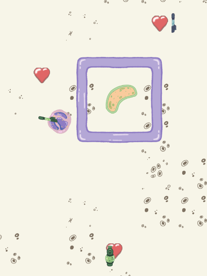

# Cytoblast #

## Summary ##

Dive into the microscopic battlefield of Cytoblast, a high-octane top-down shooter that puts you on the frontlines of cellular warfare! As a microscopic defender, you'll wield an arsenal of specialized weapons - from antiviral rifles to antibiotic machine guns - as you battle against an infection of hostile microorganisms. Dash through a maze of cellular chambers, strategically switching between weapons to counter different pathogenic threats. Face off against tactical virus turrets, aggressive bacteria, and stealthy parasitic biters while clearing room after room of escalating challenges. With fluid combat mechanics, strategic weapon management, and the ability to throw your weapons as a last resort, Cytoblast offers an intense, action-packed experience where every decision could mean the difference between cellular salvation and microscopic mayhem. Will you be the antibody this organism needs?

## Project Resources

[Web-playable version of Cytoblast](https://cqdowning.itch.io/cytoblast)

[Trailer](https://youtu.be/lT30_l2WA_A)

[Press Kit](https://petal-shaker-cb1.notion.site/Cytoblast-Press-Kit-15bc1f53cf568017b059e4f6a9154db3#3e2eb46ee41f4da993535af02411b883)

[Proposal](https://docs.google.com/document/d/1MSlS52ui7cZe5zUArDbUQV3-Qev-chPhb2aMK8_9N7w/edit?usp=sharing) 

## Gameplay Explanation ##

The game uses keyboard and mouse input for controls.
* WASD - Character movement
* Left Click - Attack
* Right Click - Throw Weapon
* Scroll Wheel - Switch Weapon
* Shift - Dash
* If the current level is too difficult, you can take the ‘L’ and skip to the next level

In order to progress, you must defeat all of the enemies in the room. Upon defeating the final enemy, the door to the next room will open. If you are to perish in your battle against cellular threats, you will have to restart the level you were on. There are three levels total to clear, good luck!

### Optimal Gameplay Strategy
The game has various levels of strategy for optimizing your gameplay. At the surface level is the type strength and weakness system. Using the proper weapon damage type against enemies will allow you to do more damage (see damage type chart). However, there are also different weapon types, such as the rifle, machine gun, and shotgun. On top of the damage type system, you also want to use the correct weapon for the given situation. For example, if there are multiple enemies in front of you, you might want to switch to a shotgun. You can also throw your weapon for big damage once it runs out of ammo. Optimal play will involve constant switching between weapons and choosing the right time to throw them. Enemies drop a lot of weapons so no need to get too attached to your weapons. Staying near walls to use as cover is also a good idea. You can also use the dash to close distance between enemies and dodge attacks, as it grants you immunity to attacks during the dash. 

#### Damage Type Chart:
|                        | Bacteria (Green) | Virus (Blue) | Parasite (Orange) |
| ---------------------- | ---------------- |------------- |------------------ |
| Antibiotic (Green)     | 1.5x             | 0.75x        | 1x                |
| Antiviral (Blue)       | 1x               | 1.5x         | 0.75x             |
| Antiparasitic (Orange) | 0.75x            | 1x           | 1.5x              |

As a tip, virus enemies are the least common enemy type. This means holding on to antibiotic weapons might be a good idea since they only do less damage against the uncommon virus type.

# External Code, Ideas, and Structure #

[Inspiration for smooth floating weapon drops](https://www.youtube.com/watch?v=3ZXrUhoBbUI&t=68s)

[Text Font](https://www.1001fonts.com/chewy-bubble-font.html) - [Free for personal use](https://www.1001fonts.com/licenses/general-font-usage-terms.html)

[Trailer Music](https://www.youtube.com/watch?v=7xRhw5nOkCs) - [premium license](https://darkfantasystudio.com/premium-licence/) purchased from [Humble Bundle](https://www.humblebundle.com/software/big-royaltyfree-game-dev-music-and-sfx-software).

[Damage Indicator](https://github.com/cqdowning/cytoblast/blob/main/scripts/effects/damage_indicator.gd) - Based on damage indicator from Exercise 3

# Main Roles #

## Producer - Casey Downing

*Communication* - All communication was done through a Discord server. We had a single main chat with threads for each feature being worked on.

*Task Delegation* - To delegate tasks I kept things simple and created Discord threads for each feature that needed to be implemented. This meant we could keep discussions for features contained in one place. Inside the thread, I would describe the feature that needed to be added and then ping the team member responsible for implementing it. We would continue any discussion inside of that thread until the feature was completed.


*Git Workflow* - For every feature we implemented, we created new branches in the git repository that were based on the development branch. Once a feature was complete, we would create a pull request. As the producer, I would test the feature and fix any merge conflicts or sometimes bugs for critical features. Once I felt the feature was ready, I would merge the feature into the development branch. After the branch was merged, I would delete that branch to reduce the clutter.

### Logistics Problems
*Code Style* - Towards the end of development, the code style was not consistent. I thought we would all be following the same code style guidelines from Godot but that ended up not being the case. Even with the code style guide, people have different preferences that resulted in the code style varying in different areas. For example, the code style guide recommends using plain english, such as “and,” “or,” and “not,” for boolean operators but some of us used the traditional operators (I myself am guilty of this). I took responsibility for not establishing strict style guides sooner and I went through the code and fixed the inconsistencies myself. [Example of a clean up commit](https://github.com/cqdowning/cytoblast/commit/66ca6fc33ac363ed88e81b9b032c52c7dce5f479#diff-3be4409557b9095a29d84623584be93cd46579b0a28239eea3677f5a84533856)

*Scheduling* - One of my biggest regrets with this project was not maintaining a strict schedule for development. At the beginning, features that were critical for development would not be done quickly enough which delayed further features from being developed. If I had set stricter deadlines, I could have planned for when each feature would be completed and if someone was busy with other work I could have quickly reassigned tasks to someone who could meet the deadline. Development speed ended up being slower than I would have liked and I had to implement a few features myself to keep development moving.

*Team Communication* - Team communication became lacking at times. Tracking progress would sometimes become difficult as team members would not push code to the repository until the feature they were working on was complete. This made it hard for me to tell how close a feature was to completion. I should have been stricter with pushing branches to the repository and having the team push small commits over time. I also should have pushed more for clear and frequent communication.

#### Closing Thoughs on Logistics Problems

I have never worked on such a large project that required development to be this fast-paced, let alone one where I had to manage a team. I vastly underestimated how long it would take to develop certain features. I feel like I could have made more efficient use of my team members' time through the use of the aforementioned scheduling and keeping better track of all the features. Nevertheless, Cytoblast became a great learning experience for me and I feel I better understand what it takes to be a project manager.

### Templates and Design
As the producer, I was responsible for the game design. To ensure everyone was on the same page, I created base classes for features that needed to be further developed. I also took on any tasks that needed to be completed quickly when the other team members already had work or the feature did not apply to the other roles.

*Test Levels* - Added two test levels with a basic tileset that had collision. This was important for testing player movement and level switching. They were then deleted in favor of the actual levels. [Commit For Test Levels](https://github.com/cqdowning/cytoblast/commit/32fd5fb390c1da6cdbb137b5f64c261a54b865b7)

*Weapon Base Class* - Added a base class for weapons. There are functions for activating, deactivating, and shooting the weapon among a few other helpers. The shoot function was designed to be overridden and replaced with each weapon’s unique firing pattern. However, the base class handles the timing for when the shoot function is called on each weapon. [Weapon Base Class](https://github.com/cqdowning/cytoblast/blob/main/scripts/weapons/weapon_base.gd) 

*Enemy Base Class* - Added a base class for enemies. Enemies could be one of three types: bacteria, parasite, or virus. The base class was designed with an abstract ai function that was meant to be used to implement movement. Later we expanded the class with helper functions as well as the ability for enemies to do contact damage. The base class also handles enemy attack timing. [Enemy Base Class](https://github.com/cqdowning/cytoblast/blob/main/scripts/enemies/enemy_base.gd) 

*Level Design* - I designed all three levels. The basic level design is as follows: 
* Have an easy to defeat enemy(s) at the start to give the player their first weapon(s)
  * The starting enemy(s) always have 1 health
* Use unique layouts and enemy compositions
* Have around 4-5 rooms per level
* Levels should get progressively more difficult

The first level was what we used in our demo. The main problem with the level design was the difficulty of the demo level varied a lot with playtesters. Players more experienced with the genre felt it was too easy while other players struggled to get past the first enemy. I decided to make the first enemies of the levels all take one hit to defeat. In the end, level 1 went mostly unchanged after the demo since I felt it had a decent base line difficulty. After a few attempts, level 1 should be fairly easy to get past due to its large rooms and low enemy count.
[Level 1 Scene](https://github.com/cqdowning/cytoblast/blob/main/scenes/levels/level_1.tscn)


Level 2 increases the difficulty level by having more enemies and it has some more interesting room layouts. I tried to keep room sizes smaller to force more tense situations and I increased the enemy density so that all enemies felt threatening. I also made the player travel to the right in level 2 to make it feel different from level 1. This also grants the player a little extra look ahead due to the camera being wider than it is tall.
[Level 2 Scene](https://github.com/cqdowning/cytoblast/blob/main/scenes/levels/level_2.tscn)


Level 3 is the last level so I wanted to make it feel like a final gauntlet. Level 3 only has a few rooms but they are larger with many enemies and fewer walls to hide behind. The rooms also spawn multiple sets of enemies over time. I tried to make the final room interesting by having it progressively open up with more enemies spawning each time. Additionally, I decided to make the player travel downward into the depths of the level. This also reduces the player’s lookahead. Overall, I think it feels like a proper final level.
[Level 3 Scene](https://github.com/cqdowning/cytoblast/blob/main/scenes/levels/level_3.tscn)


### Additional Features

*Throwable Weapons* - This was a more advanced feature so I wanted to handle it. We needed a way to discard the player’s weapon and I thought it would be interesting if you could throw it for big damage. This solved our weapon discard problem and it gives a risk/reward decision for the player to make. After throwing the weapon, it is discarded and the weapon creates an explosion projectile on collision with an effect that fades out. The projectile uses the sprite of the weapon that was thrown so that I didn’t have to create a version for all nine weapons. The damage type and explosion effect always uses the same type as the thrown weapon.
[Thrown Weapon Projectile Class](https://github.com/cqdowning/cytoblast/blob/main/scripts/projectiles/projectile_player_thrown_weapon.gd) 

*Shooter Enemy* - The first enemy to be implemented was the "shooter" or bacteria enemy. I created the enemy using the enemy base class that I wrote. I implemented the _ai and _shoot functions inside the class to make the bacteria move and shoot. The bacteria will try to stay at a certain distance away from the player and shoot towards the player at a constant rate. I implemented this enemy myself to push along development and provide an example of how enemy behavior should be written.
[Shooter Enemy Class](https://github.com/cqdowning/cytoblast/blob/main/scripts/enemies/shooter.gd)

*Weapons* - I ended up adding all three weapon types, each with three damage type variants. The weapons are built from the weapon base class. The weapons implement the shoot function to handle their behavior. The rifle fires in a straight line towards the cursor. The machine gun has a random spread. The shotgun fires multiple bullets at once with a spread. This was also when I added the projectile speed variation to the weapons as detailed in the Game Feel section.
[Machine Gun Class](https://github.com/cqdowning/cytoblast/blob/main/scripts/weapons/weapon_machinegun.gd) / [Rifle Class](https://github.com/cqdowning/cytoblast/blob/main/scripts/weapons/weapon_rifle.gd) / [Shotgun Class](https://github.com/cqdowning/cytoblast/blob/main/scripts/weapons/weapon_shotgun.gd)

### Cut Features
There were several features that I decided to cut due to time constraints. If we were to continue updating the game, these are features that could be added.

*Boss Fight* - The initial plan document details a final boss fight after the three levels. In order to implement the final boss, we would have had to add several new mechanics and features to our existing code. For example, we wanted the boss to spawn waves of enemies but the current implementation for enemy spawning is specifically made for rooms. We would have had to add to and alter the existing code to make it work.

*Aim Camera* - I wanted to experiment with a camera that lerps to the midpoint between the player and the cursor. This would allow the player to look ahead in the direction they are aiming. 

*Graze System* - To add a way for the player to heal, I wanted to implement a system for healing the player after successfully dodging a projectile. This would have added more risk/reward to the game but we decided it would have been too complicated to implement with the time we had remaining and used simple enemy health drops instead.

*Dialogue* - The game was originally supposed to be about a cell created by a scientist. The different levels were trials that the scientist was putting the cell through. During down time in the game, there would have been dialogue from the scientist commenting on the cell’s performance. While this would have expanded the lore of the game, it was lower in priority to gameplay features and it had to be cut.

### Known Issues

*Melee hitbox can stay active* - Performing a dash while the melee hitbox is active results in the hitbox staying active until another melee attack is performed. This exploit has low impact on game balance. Thus, I decided to keep this exploit in the game since its somewhat fun and simple.

*Thrown weapons can collide with walls too early* - If the player is right next to a wall when they throw a weapon, the weapon can collide with the wall instantly. This is caused by the weapon's collision box being to large and intersecting with the wall the instant it spawns in. However, I wanted the thrown weapon to have a large hitbox to make it easier to hit enemies. Unfortunately, projectiles are not built to have a separate collision for walls and enemies. Hence, this small issue remains.

## User Interface and Input - Quinn Broderick

*Main Menu* - The main menu has two primary buttons, the bigger of the two is the “Click to Play, CYTOBLAST” button that starts the game as soon as it's pressed. The other is the smaller credits button that will take you to the list of the game makers’ names and roles. Both buttons will be shadowed by a faint pink rectangle when hovered over; the opacity and color of the rectangular trace were written into each of the scripts associated with the buttons and were defined in the _ready() functions. This feature is supposed to let the user know which are clickable elements on the main menu. The background was also designed using our gameplay tileset. I used the get_tree().change_scene_to_file() in the _on_pressed() functions (linked via the node signals) for the buttons so that there would be an immediate transition to either the first level scene or the associated credits scene. [Start button script](https://github.com/cqdowning/cytoblast/blob/d74ae23a263a4d752c9cb22bdbe0607864586f93/scripts/start_button.gd#L1) 


*Credits* - The credits screen contains the team’s names and roles using the same theme as the Main Menu (tileset, font, font colors, hovering background for buttons) but only contains an exit button in the top right corner that, when pressed, returns the user to the Main Menu. It uses a script very similar to the Main Menu. [Exit credits script](https://github.com/cqdowning/cytoblast/blob/d74ae23a263a4d752c9cb22bdbe0607864586f93/scripts/exit_credits.gd#L1) 

*End Screen* - The end screen is done in a very similar style as the Main Menu: the user has two button options, either view the credits or restart the game. The buttons are done in an almost identical fashion as described in the Main Menu section, a faint pink rectangular background appears when hovered to indicate it’s interactable. This scene can only be reached after the game has been completed successfully. The restart button also implements the get_tree().change_scene_to_file() function to jump cut right back to the first level when pressed. The credit scene is the same as described before. [Restart button](https://github.com/cqdowning/cytoblast/blob/d74ae23a263a4d752c9cb22bdbe0607864586f93/scripts/restart_button.gd#L1)


**Heads-up Display:**

*Health Bar* - The top left corner of the screen shows the player’s health bar, which is a progress bar linked to a signal from the player.gd script letting the hud.gd script know when the player’s health has been changed. I used Godot’s theme overrides to match the font and style to the theme used throughout our game to maintain the aesthetic; the progress bar reads “PLAYER HEALTH: “ and then displays the progress bar containing the player's current life percentage left. 

*Ammunition* - In the top right corner, there is an ammunition readout for the player’s weapons. Also done in the same theme as all text in the game, the readout shows the number of rounds left separated by / and followed by the maximum amount of rounds the current weapon can hold. Without a weapon equipped, it defaults to a “0/0” readout. 

*Weapon Selection/Inventory* - There is also a list of potential weapons below the ammo readout, Rifle, Shotgun, and Machine Gun, when no weapons are equipped, all three labels are dark gray (indicating nothing is being used). When a weapon is equipped, a signal is sent from the inventory to the hud, alerting it to which weapon was added. Once added, the sprite image of the weapon will appear below the labels, and the label will turn the color of the selected weapon. As you acquire and throw weapons the Weapons Container will show the inventory you have accordingly and the label corresponding to the the weapon you are using will highlight the color of the gun. 
[All the code for the previous can be found in the hud.gd script](https://github.com/cqdowning/cytoblast/blob/d74ae23a263a4d752c9cb22bdbe0607864586f93/scripts/hud.gd#L1)


**Input/Game Controls**

The game is designed for Desktop, I thought about adding game controller inputs but I couldn’t find a combination that I liked for certain actions with a game controller or on a mobile device.

*Gameplay on Desktop* - navigate the player around using the movement commands listed below. To attack your enemy left-click to either melee or fire whatever weapon you have equipped. To dash hold down shift and any of the movement commands for a brief speed boost. Weapons are picked up automatically, to switch your weapon use the mouse wheel up or down. 

*Command Controller* - Commands are determined in a fashion very similar to what we implemented in exercise 1 from class, we have a controller that responds to input and executes the associated command, which is defined by the base class commands.gd, with each specific action being defined based on the input. [Example of a throw command](https://github.com/cqdowning/cytoblast/blob/d74ae23a263a4d752c9cb22bdbe0607864586f93/scripts/controller_command.gd#L51)


## Movement/Physics - Cory Pham

Our game uses a hybrid approach to physics and movement, building upon Godot's [CharacterBody2D](https://github.com/cqdowning/cytoblast/edit/main/ProjectDocument.md#:~:text=player.-,tscn,-scripts) system while implementing custom mechanics for precise control. The movement system centers around mouse-aimed directional movement, where the player smoothly rotates to face the cursor while maintaining independent movement direction through our 
[command pattern implementation.](https://github.com/cqdowning/cytoblast/blob/main/scripts/player.gd#L177C1-L190C34:~:text=commands-,command,-.gd)

Key Features:
- Base Movement System
  - [Top-down movement](https://github.com/cqdowning/cytoblast/edit/main/ProjectDocument.md#:~:text=melee_command.gd-,move_command,-.gd) with independent rotation
  - Mouse-aimed directional control
  - Smooth rotation interpolation
  - Configurable movement speeds and sensitivity
- Advanced Movement Mechanics
  - [Dash ability](https://github.com/cqdowning/cytoblast/blob/main/scripts/player.gd#L80C1-L88C49:~:text=command.gd-,dash_command,-.gd) with configurable distance and speed
  - Invulnerability frames during dash
  - Cooldown system for abilities
  - Momentum-based movement transitions
- Weapon System & Physics
  - Three distinct weapon types:
    - Rifles: Precise, single-shot weapons
    - Shotguns: Spread-based, close-range weapons
    - Machine Guns: Rapid-fire, sustained damage
  - Weapon Mechanics:
    - Projectile [spawn point system](https://github.com/cqdowning/cytoblast/blob/main/scripts/player.gd#L177C1-L190C34:~:text=projectiles-,projectile_base,-.gd)
    - Configurable spread patterns
    - Speed variation for projectiles
    - Screen shake feedback system
    - Ammo management system
  - Weapon States:
    - Equipped vs Unequipped behaviors
    - Hover animations when dropped
    - Pickup detection
  - Weapon Type Categories:
    - Antibiotic: Effective against bacteria
    - Antiviral: Counters virus enemies
    - Antiparasitic: Specialized for parasites
  - Enemy Movement Types
    - [Shooter](https://github.com/cqdowning/cytoblast/blob/main/scripts/enemies/shooter.gd) (Bacteria Type):
      - Intermediate movement enemy
      - Shoots at player with green projectiles
      - Relatively slow and timer-based movement
    - [Turret](https://github.com/cqdowning/cytoblast/blob/main/scripts/enemies/turret.gd) (Virus Type):
      - Stationary defensive enemy
      - Rotates to track player position
      - Fires projectiles in ring patterns
      - Uses timer-based movement phases
      - Alternates between stationary attack and repositioning
    - [Biter](https://github.com/cqdowning/cytoblast/blob/main/scripts/enemies/biter.gd) (Parasite Type):
      - Aggressive melee enemy
      - Direct chase behavior towards player
      - Quick burst movements
      - Close-range attack patterns
      - Uses velocity-based movement for smooth pursuit
    - Base Enemy Features:
      - Health and damage systems
      - Type-specific weapon drops
      - Custom collision detection
      - Death animations and effects
      - Specialized audio feedback
      - State-based behavior patterns

While we utilize Godot's physics engine as a foundation, we've implemented significant customizations for more precise control and game-specific mechanics. The [weapon system](https://github.com/cqdowning/cytoblast/edit/main/ProjectDocument.md#:~:text=projectiles-,weapons,-audio_manager.tscn) particularly demonstrates this with custom projectile physics, spread patterns, and interaction systems.


The movement system in this project is built around the `Player` class, which extends `CharacterBody2D` in Godot. It uses a **state machine** to manage player states and integrates custom logic for various movement types such as walking, dashing, and melee attacks. This design ensures clean separation of concerns and allows for precise control and easy extensibility.

### **Player States**
The player's movement and actions are governed by an enum-based state machine (`PlayerState`):
- **IDLE**: The default state when the player is not moving or performing actions.
- **MOVING**: Active state when the player moves based on directional input.
- **DASHING**: A high-speed burst movement with temporary invulnerability.
- **MELEE**: Engaged during close-combat attacks.

```gdscript
enum PlayerState {
    IDLE,
    MOVING,
    MELEE,
    DASHING,
}
```

### **Movement Logic**
Player movement is implemented using Godot's `move_and_slide()` method, which handles collision detection during movement. The `move()` function calculates the movement vector based on player input and normalizes the velocity to ensure consistent speed regardless of input magnitude. It uses a command pattern through classes like [move_command](https://github.com/cqdowning/cytoblast/blob/main/scripts/player.gd#L80C1-L88C49:~:text=melee_command.gd-,move_command,-.gd) and [dash_command](https://github.com/cqdowning/cytoblast/blob/main/scripts/player.gd#L80C1-L88C49:~:text=command.gd-,dash_command,-.gd) that provide decoupled input handling, consistent movement behavior, easy extension for new movement types, and clean separation of concerns. This architecture allows for complex movement mechanics while maintaining clean, maintainable code. The hybrid physics approach (using both engine physics and custom calculations) provides precise control while maintaining realistic collisions and interactions. The dash system features temporary invulnerability frames with modified collision behaviors, allowing players to dash through enemies while maintaining wall collisions.

### **Smooth Rotation**
The player's orientation is dynamically aligned with the mouse cursor using smooth interpolation `(lerp)` for fluid aiming.

```gdscript
var target_angle: float = (get_global_mouse_position() - global_position).angle()
rotation += angle_diff * rotation_speed * delta
```

### **Collisions with Movement**
The player's collision is dynamically checked against obstacles during the dash. A dot product calculation ensures the player stops if colliding against an obstacle in their path.

```gdscript
for i in get_slide_collision_count():
    var collision = get_slide_collision(i)
    if direction.normalized().dot(collision.get_normal()) < -0.5:
        blocking_dash = true
        break
```
I implemented specialized collision layers that handle different [interaction player types](https://github.com/cqdowning/cytoblast/blob/4d57b39c29fd9ce0c9d3ad59480c4515fcf127e1/scripts/player.gd#L177C1-L190C34) that are separate from combat hitboxes, and projectiles have their own collision masks. 
Collision Layers:
1. Player Movement Collisions: Handles general movement and environmental interactions.
2. Combat Hitboxes: Independent hitboxes for melee attacks, ensuring precise damage calculation.
3. Projectile Collisions: Custom masks for weapon projectiles, allowing distinct behaviors for different projectile types.

### **Projectile Interactions**
Thrown weapons and projectiles are dynamically instantiated and launched in the direction of the mouse cursor. Each projectile uses its own collision layer and applies damage to enemies upon impact.

```gdscript
var projectile:ProjectileThrownWeapon = thrown_weapon_scene.instantiate()
projectile.launch(global_position, direction)
```
Each weapon type has unique [projectile physics](https://github.com/cqdowning/cytoblast/blob/main/scripts/projectiles/projectile_player.gd#:~:text=levels-,projectiles,-projectile_base.gd): rifles have straight-line trajectories with single-target penetration, shotguns implement spread patterns with multiple collision checks, and machine guns handle rapid-fire collision detection. Enemy types also feature distinct collision behaviors - Turrets have stationary collision zones for their rotating attacks, while Biters use dynamic collision detection for their chase and melee mechanics. This layered approach to physics and collisions creates a responsive combat system while maintaining consistent game feel.

We created a hybrid system where core movement and collisions use the physics engine, but many features like weapon handling, projectile behavior, and enemy movement use custom calculations outside the physics system. This approach allows for precise control while maintaining proper physics interactions where needed.

This implementation creates a responsive, fluid movement system with engaging weapon mechanics that support both precise combat and dynamic enemy interactions, while maintaining consistent physics behavior throughout the game.


## Animation and Visuals - Noor Ashour

All the assets were hand-drawn. This includes:

- Player sprites and animation
- Enemy sprites and animation
- Weapon and bullet sprites
- Tileset of walls and background
- Health item
- Decorative objects and decal
- UI design (health bar, game title and buttons)

I opted to use a hand-drawn visual style as that's what I'm familiar with. The players and enemies look like cells but in a Western cartoon style. I used FireAlpaca for the drawing software and used their preset brush "Fluffy" for a hand-drawn/cartoonish feel.

Since the animations were simple, I used an Animation Player that modifies the sprites' frames. When drawing the animations, I exported the individual sprites and used an [online spritesheet maker](https://www.finalparsec.com/tools/sprite_sheet_maker). When implementing the animation, I had to tinker with the AnimationPlayer’s key frames to make the animation smooth.

I created a [theme](https://github.com/cqdowning/cytoblast/blob/main/assets/default_theme.tres), or .tres file, to implement the button sprites. I had to draw them in a way that allows me to apply “Nine Slice” margins. This way, the sprite can be stretched without looking weird.

All my work related directly to the narrative core of the game. Almost every sprite has the look of a cell or micro-organism, whether it be an enemy or a health item. I made the walls look like long cells, and drew background tiles with tiny cells or DNA strands as decoration. Since my sub-role is narrative design, more details about how the art intersects with world-building and narration will be in that sub-role’s summary.

For the visual style guide, I created a [design document](https://docs.google.com/document/d/158W1hcS9_ig8T-zrRVKkaezIWNe5X8yCE7sUagEImhA/edit?pli=1&tab=t.0) to house the color palettes, inspiration and reference images, and any extra design info I might need. I also created a [Todo List](https://docs.google.com/document/d/1KbzWFUy0fizjDJrwQ3nopHDPXG2zpBGNWMK9zKoEpvw/edit?pli=1&tab=t.0) to manage my tasks.

## Game Logic - Jack Schonherr

My work around game logic involved creating a global game manager, developing the base level architecture, implementing an inventory system, and handling damage logic. Each of these systems can be felt throughout the game and interacts with other mechanics including movement, physics, UI, and visuals.

*Game Manager Singleton* - I created an autoloaded game manager singleton which is the “brains” behind the whole game. It holds three primary global variables which other scripts reference: `room_id`, `room_active`, and `enemies_remaining`. `room_id` is an integer that refers to the index of the room the player is currently in. Levels use this number to open the correct door upon clearing a given room. This number increments and resets as players clear rooms and restart levels, a process which I will describe further in the *Level Architecture* section. `room_active` is a boolean flag that indicates whether or not the player is currently in a room. This is used alongside the `enemies_remaining` variable, which is an integer that represents the number of enemies left to defeat in the current room. Together, these two variables are checked in the `_process()` function of the game manager to emit a signal telling other areas of the game when a room is complete. The `room_active` flag allows us to have downtime between rooms because if we only checked for zero enemies remaining, the signal would emit over and over. The game manager also has one public function, `change_level()`, which allows other areas of the game to switch the scene to a menu or the next level. Its last main duty is to restart levels, implemented in the `_restart_level()` function. [Game_manager script](https://github.com/cqdowning/cytoblast/blob/main/scripts/game_manager.gd)

*Level Architecture* - I designed the technical architecture of each level with the hope of abstracting away as much as possible. The goal was to allow my team to simply place scenes on the tilemap, assign some exported variables, and have everything work. Each level inherits from the base level scene. This base scene encompasses everything a level needs at bare minimum – tile map layers for the background and walls, decal and object decorations, a player spawn point, a gate to transition to the next level, a player instance and its controller, and a camera controller with a HUD. Players spawn at their spawn point with an empty inventory of weapons and full health. The base level has no notion of a “room” on its own, so I created additional scenes and their corresponding scripts to encompass the concept of a room within a level. [Level base script](https://github.com/cqdowning/cytoblast/blob/main/scripts/levels/level_base.gd)


Upon entry, a room entrance alerts the game manager to set room_active to true, initializes `enemies_remaining` to the number of enemies in the room, and increments `room_id`. The player cannot advance until all enemies in the room are defeated, which signals for the room to open its door. Room scenes must be named “RoomX”, where X is its ID number, so that the level knows what the correct sequence of rooms is. Rooms are connected to their doors via an exported variable, so when the level hears from the game manager that the current room is completed, it will tell the current room to open its door. [Room script](https://github.com/cqdowning/cytoblast/blob/main/scripts/levels/room.gd). [Room door script](https://github.com/cqdowning/cytoblast/blob/main/scripts/levels/room_door.gd). 

Enemies are spawned by enemy spawners, which have exported variables for the sequence of enemies they spawn, initial delay upon room entry, and delay between spawns. After the initial delay, enemies will be spawned at the spawner’s location according to an array of enemy specification classes. The spawners iterate through this array once and use the factory pattern to instantiate enemies based on their specifications. The specification classes include the enemy’s type, its pool of possible weapon drops, its max health, and chance to drop a health pickup. I made this class inherit from Resource so that we are able to make instances of it in the inspector, which made it really simple for my team to build and balance enemy spawners. [Enemy spawner script](https://github.com/cqdowning/cytoblast/blob/main/scripts/levels/enemy_spawner.gd). [Enemy factory script](https://github.com/cqdowning/cytoblast/blob/main/scripts/enemies/enemy_factory.gd). [Enemy spec class script](https://github.com/cqdowning/cytoblast/blob/main/scripts/enemies/enemy_spec.gd).

These three scenes make up the concept of a room, and they can be instantiated in levels at will to create a complex series of challenges. All together, this creates a level. If the player dies at any point during the level, regardless of the room they are in, they are respawned back at the spawn point and their player state returns to empty inventory and full health. This is handled by the `_restart_level()` function in the game manager.


*Inventory System Singleton* - I also created the entire weapon inventory system for Cytoblast. This is also an autoloaded singleton because many areas of the game need to reference it. It contains signals for the HUD, a max size constant, an array of weapons, a private int representing the currently equipped slot, and a bunch of functions. When the inventory is autoloaded, it is initialized with null entries for each of its slots. I decided to do this rather than have it start completely empty to not have to deal with resizing, and it allowed me to do some neat arithmetic with indexing. This is much more efficient than searching an array of unknown size (although this array uses such little space anyways that it probably doesn’t matter). The inventory has public functions to do things like get the current slot, get the current weapon, add to, and drop from the inventory. It has private methods for performing utilities such as finding the next empty slot and switching the closest taken slot. I had to think about things like what slot to fill next when the player picks up a weapon, what slot to auto switch to when they throw a weapon, and how to handle scrolling through weapons. I designed the whole thing so that the rest of the game only ever knows about the weapon in the current slot. On any event where the weapon would change, the inventory handles that change and tells the rest of the game to look at the current slot’s weapon again (because it has been updated). [Inventory script](https://github.com/cqdowning/cytoblast/blob/main/scripts/inventory.gd)

I did some admittedly cool stuff when implementing weapon switching on the player. It seemed naive at first – I would simply delete the current weapon node from the player and replace it with whatever weapon is in the slot that was switched to. However, I learned I could not use `queue_free()` to do this. `queue_free()` deletes the node completely, so when trying to switch back to that weapon later, I was trying to access a previously freed object in memory. Instead, I had to use `remove_child()`. This removes the weapon node from the player, but that node still exists in the global inventory. This way, the player can still reference that weapon later when they need to switch back to it. In essence, the player never actually has the original weapon they picked up – they simply have a reference to the weapon from the inventory (which stores the original weapon), added to the player with `add_child()`. I learned a lot about how Godot works with this simple, but cool, implementation. [Player weapon switching](https://github.com/cqdowning/cytoblast/blob/69e667fd0886d5464629b87d06f970472dbf1bfb/scripts/player.gd#L270).


*Damage Engine and Weapon Drops* - My final big contribution in game logic was creating the damage engine and implementing weapon drops from the enemies. The damage engine class has one static method for returning a damage multiplier. The function takes in the projectile type and enemy type to return a multiplier based on a simple RPS-adjacent interaction system, much like the one in Exercise 3. This multiplier is used to calculate damage to enemies and tells the damage indicator scene what color to make its font. [Damage_engine script](https://github.com/cqdowning/cytoblast/blob/main/scripts/damage_engine.gd)

I also created the system for enemies dropping weapons because it ties closely to the inventory system. When enemies die, they choose a random weapon from their pool of possible drops (if the pool is nonempty) and instantiate it as a weapon in the current level. Then, when the player walks over it and has space in their inventory, they actually pick up the weapon. An open slot in the inventory is assigned that weapon instance, and then much like switching between weapons, the weapon is just removed from the level and not deleted completely so that it can be referenced later. [Enemy weapon drops](https://github.com/cqdowning/cytoblast/blob/69e667fd0886d5464629b87d06f970472dbf1bfb/scripts/enemies/enemy_base.gd#L87). [Adding weapons in the inventory](https://github.com/cqdowning/cytoblast/blob/69e667fd0886d5464629b87d06f970472dbf1bfb/scripts/inventory.gd#L75).

# Sub-Roles

## Audio - Jack Schonherr

*Assets* - All of the sound files I used for Cytoblast are listed on itch.io under a [CC0 1.0 Universal License](https://creativecommons.org/publicdomain/zero/1.0/deed.en), meaning the sounds are dedicated to the public domain. While credits are not required when using these sounds, I have listed the sources for each of the sound files below. 

From https://kronbits.itch.io/freesfx#google_vignette:
* [weapon_switch.wav](https://github.com/cqdowning/cytoblast/blob/main/assets/audio/sound%20effects/weapon/weapon_switch.wav)
* [machine_gun_shoot.wav](https://github.com/cqdowning/cytoblast/blob/main/assets/audio/sound%20effects/weapon/machine_gun_shoot.wav)
* [rifle_shoot.wav](https://github.com/cqdowning/cytoblast/blob/main/assets/audio/sound%20effects/weapon/rifle_shoot.wav)
* [shoot_attack.wav](https://github.com/cqdowning/cytoblast/blob/main/assets/audio/sound%20effects/enemies/shoot_attack.wav)
* [enemy_spawn.wav](https://github.com/cqdowning/cytoblast/blob/main/assets/audio/sound%20effects/environment/enemy_spawn.wav)
* [player_hit_marker.wav](https://github.com/cqdowning/cytoblast/blob/main/assets/audio/sound%20effects/player/player_hit_marker.wav)
* [player_dash.wav](https://github.com/cqdowning/cytoblast/blob/main/assets/audio/sound%20effects/player/player_dash.wav)
* [health_pickup.wav](https://github.com/cqdowning/cytoblast/blob/main/assets/audio/sound%20effects/environment/health_pickup.wav)
* [room_enter.wav](https://github.com/cqdowning/cytoblast/blob/main/assets/audio/sound%20effects/environment/room_enter.wav)

From https://ne-mene.itch.io/general-sound-pack: 
* [weapon_explosion.wav](https://github.com/cqdowning/cytoblast/blob/main/assets/audio/sound%20effects/weapon/weapon_explosion.wav)
* [weapon_throw.wav](https://github.com/cqdowning/cytoblast/blob/main/assets/audio/sound%20effects/weapon/weapon_throw.wav)
* [weapon_pickup.wav](https://github.com/cqdowning/cytoblast/blob/main/assets/audio/sound%20effects/weapon/weapon_pickup.wav)
* [melee.wav](https://github.com/cqdowning/cytoblast/blob/main/assets/audio/sound%20effects/weapon/melee.wav)
* [shoot_blank.wav](https://github.com/cqdowning/cytoblast/blob/main/assets/audio/sound%20effects/weapon/shoot_blank.wav)
* [enemy_hit_marker.wav](https://github.com/cqdowning/cytoblast/blob/main/assets/audio/sound%20effects/enemies/enemy_hit_marker.wav)
* [room_door_open.wav](https://github.com/cqdowning/cytoblast/blob/main/assets/audio/sound%20effects/environment/room_door_open.wav)
  
From https://hzsmith.itch.io/free-sfx-pack-vol-1:
* [biter_attack.wav](https://github.com/cqdowning/cytoblast/blob/main/assets/audio/sound%20effects/enemies/biter_attack.wav)
  
From https://hzsmith.itch.io/free-sfx-pack-vol-2:
* [shotgun_shoot.wav](https://github.com/cqdowning/cytoblast/blob/main/assets/audio/sound%20effects/weapon/shotgun_shoot.wav)

*Audio System Implementation* - I created an audio manager singleton scene to play sound effects, as well as a sound effects bus. Each sound effect has its own audio stream player and associated function that gets called when the sound is needed. The singleton is useful because it centralizes all sound effects into one area that can be accessed by any node. Sound effects originate from many different places, so it is more efficient to do it like this than have individual audio stream players on nodes. All of the audio stream players use the sound effects bus, so I can tune their audio easily. If we wanted to add other buses in the future for a soundtrack, etc., the infrastructure is already in place to do so. [Audio manager script](https://github.com/cqdowning/cytoblast/blob/main/scripts/audio_manager.gd)

*Sound Style* - I was admittedly limited by sounds available online under the CC0 license, but I think the sound palette still works. The style is a mix of classic gaming and futuristic vibes, which fits the cellular aesthetic. Using real gunshot sounds, for example, did not feel right because our weapons are cell-based. It wouldn’t sense for them to sound like real assault rifles. The tracks for little sound effects like hit markers and picking up weapons are very subtle but help with game immersion in my opinion. They coincide with the visual feedback of a damage number and seeing the weapon disappearing, respectively, to create a more satisfying experience for the player. Visual feedback without audio feels less impactful.

The sounds can get overwhelming at times, especially with many concurrent enemy spawns. That sound in particular is loud and a little unsettling by design, but too many of them at once is louder than I’d like. Overall, though, I think the game sounds good.
 

## Gameplay Testing - Cory Pham and Quinn Broderick

[These](https://docs.google.com/spreadsheets/d/1nMg0oud1pyU_8W3mC56qX38ab4eTNiMxi88uNB_Y8t4/edit?usp=sharing) are the results of the Google Forms survey we sent out to our playtesters. We had 11 responses.

**Gameplay Feedback**

- Overall our demo received positive feedback (average rating of 4.4/5 on gameplay experience), with users enjoying the game's narrative, weapon variety/use and the simplicity of the concept
- We also had very positive feedback on player movement and controls (average rating of 4.5/5), with users being particular fond of the basic movement and the rifle weapon
- Most of the testers found the game's difficulty to be just right (64%) but expressed ranging difficulty in understanding enemy attack patterns and behavior

**Changes Made Based on Feedback**
- There were some issues with understanding the HUD's inventory system, so we decided to change the HUD to show the actual weapons in the player's inventory and highlight the selected weapon label with the weapon's color
- There were also a couple requests to add a little bit more to the game's environment, so we added a few more visual elements to the game's levels (extra clumps of cells on walls, more detailed obstacles etc.)

**Further Improvements**
- Given more time there were requests for more variety in enemy types and behaviors, as well as more weapon types that could've been added to the game
- There were also a couple of requests for a multiplayer mode, which could be an interesting addition to the game
- The HUD could also just use a little bit more polish, maybe eliminating the labels and just using some sort of higlight to show selected weapons

## Narrative Design - Noor Ashour

I originally wanted to add dialogue for the narration, but I unfortunately ran out of time. Instead, I tried to focus on implementing the narration via the assets, since it was my main role.

I used microscope images of white blood cells to determine the player's look. There were different white blood cell types, so I combined their looks: Neutrophil (bacteria killer), Eosinophil (parasite killer), and Lymphocyte (virus killer). Since the player is a "super soldier" white blood cell, this implies that it's a mutation of different types to enhance its strengths.

I gave the player an 80% opacity to the body color, making it look like cell fluid. I also did this for the buttons and game title, because their looks and colors are based on the player. There are cell objects that are drawn like the player but have 100% opacity. They are meant to be previous white blood cells that failed and “died”, making their body dense like a tumor cell.


## Press Kit - Noor Ashour

[Press kit link](https://petal-shaker-cb1.notion.site/Cytoblast-Press-Kit-15bc1f53cf568017b059e4f6a9154db3)

[Press kit materials](https://github.com/cqdowning/cytoblast/blob/main/presskit_stuff)

The press kit was made using Notion as I was already familiar with it, and it has a feature where you can publish a Notion page as a website. I also found a game press kit template, so I used that to gather what kinds of content I need for the press kit. I embedded the trailer’s video link, created screenshots and GIFs, and added the player’s color palette to serve as the game brand's colors.

The screenshots were chosen to show the gameplay and the different enemies. Additional screenshots show the UI, such as the main menu and credits scene. A GIF of the gameplay was also included to showcase the gameplay in action.

## Trailer - Casey Downing

[Link to Trailer](https://youtu.be/lT30_l2WA_A)

For the trailer, I recorded a full playthrough of the game. I tried to incorporate clips that showed off the game’s combat the best by picking the parts with the most action. I also intentionally set up the part at 0:34 where I dash through the four parasites because I thought it would look cool. Overall, the gameplay of Cytoblast is simple but fun so I tried to make the trailer reflect that. Unfortunately, the trailer was made on a version of the game without the amazing health bar and health drop sprites.

The music used in the trailer is Dark Fantasy Studio - Neon God under their [premium license](https://darkfantasystudio.com/premium-licence/). I purchased this license from [Humble Bundle](https://www.humblebundle.com/software/big-royaltyfree-game-dev-music-and-sfx-software).

## Game Feel and Polish - Casey Downing
*Screen Shake* - I implemented a simple screen shake algorithm and applied it to various parts of the game. Shooting the guns will shake the screen to make them feel more impactful. The explosion from throwing the weapon will also have a powerful screen shake.
[Camera Controller w/ Screen Shake](https://github.com/cqdowning/cytoblast/blob/main/scripts/camera_controller.gd) 

*Enemy Spawner Particles* - The enemy spawners in the level will produce a particle effect before they spawn an enemy. The color of the particle effect matches the enemy that is about to spawn. This helps warn the player when an enemy is about to be spawned so they can move out of the way.
[Commit that added particles to the existing Enemy Spawner](https://github.com/cqdowning/cytoblast/commit/433c678c74a50d816fbb06b10d0f7621c1dc3ea2)


*Damage Indicator* - Added a damage indicator similar to the one found in Exercise 3. Hitting an enemy creates a damage indicator. This indicator will be a bright color and larger when a weapon is super effective against an enemy. The indicator is gray and smaller when the weapon is ineffective against an enemy. This helps the player learn quickly about the type advantage system. Also, watching big numbers pop out of enemies is satisfying.
[Damage Indicator Class](https://github.com/cqdowning/cytoblast/blob/main/scripts/effects/damage_indicator.gd) 

*Bullet Variation* - The bullets the player fires have a slight variation in their speed. All weapons also fire in a spread, although the rifle has the smallest spread. This makes the weapons a little more interesting since the bullets will move at slightly different angles and speeds. This was especially important for the shotgun so that the bullets did not move in a straight line.
[Commit with weapons and their shoot code](https://github.com/cqdowning/cytoblast/commit/0e5db44b27ee48765a37aa0cffcda318c1f70628#diff-7d16909ae436c17648e5367112d3e4720d46d3b6617eb0d86dba7ab40d0aacba) 

*Player immune to damage during dash* - It’s fairly common for playable characters with dash abilities to have immunity during the dash. This was especially important since our game doesn’t have set bullet patterns. There could be situations where enemy attacks are completely unavoidable without dashing through them.
[Commit for player immunity](https://github.com/cqdowning/cytoblast/commit/7d0175d5777ee87e28693a5ff30bbdc32ec12e86) 

*Player feedback on hit* - I noticed it was difficult to tell when the player took damage. I made it so the player blinks red when taking damage. There is also a small screen shake effect as well. Additionally, I made it so the player is briefly immune to damage when being hit.
[Player blinking red commit](https://github.com/cqdowning/cytoblast/commit/b9bec13e10002d4ec426c2321c14faae984774ff) / [Player immune to damage on hit commit](https://github.com/cqdowning/cytoblast/commit/0f0d8fb432ec4ed9fb83e5242bd111ffcc936034#diff-2293c7a5ef44266dbd41ff1eb5c6137aab258b8c2e34d5e15dcaf6a75b21c1f7)  

*Item Detector covers the entire player* - The item detector for picking up items was a raycast towards the cursor, which meant you had to look at items to pick them up. This made it confusing to players on when they could pick up items. I changed the item detector to be an Area2D node that can grab items in all directions.
[AoE Item Detector Commit](https://github.com/cqdowning/cytoblast/commit/0f0d8fb432ec4ed9fb83e5242bd111ffcc936034#diff-2293c7a5ef44266dbd41ff1eb5c6137aab258b8c2e34d5e15dcaf6a75b21c1f7) 

*Health drop* - During playtesting, the game was too difficult for players without any way to recover health. I implemented a simple health item that has a chance to drop from enemies that heals the player when they pick it up. The drop chance can also be configured for each enemy using the enemy spec.
[Health Drop Commit](https://github.com/cqdowning/cytoblast/commit/82f30fa5933a1525b49f5b13718fbad316d68892) 

*Item drop randomness* - After introducing the health drop, both weapons and health would drop in the exact same location which did not look good. I allowed drops to be slightly offset from the enemies death position by a slight amount. The variation makes the drops more interesting to look at and the weapon and health won’t always directly overlap each other.
[Drop Offset Commit](https://github.com/cqdowning/cytoblast/commit/beff4dca616ea6aeb6187210064fdd7ac46a41d0) 

Dropped items are slightly offset:



*Slight offset on thrown weapon* - I Made the sprite of the thrown weapon slightly off-centered. This makes the projectile look more interesting as the sprite rotates around the center. It makes the weapon feel as though it has real weight.
[Thrown weapon scene](https://github.com/cqdowning/cytoblast/blob/main/scenes/projectiles/projectile_thrown_weapon.tscn)


*Balancing* - Over the course of development I made various balance changes to all parts of the game. For the player, I tweaked player movement speed and dash speed and distance. For weapons, I changed the fire rates, projectile speeds, max ammo, and damage. For enemies, I tuned their health, damage, movement speed and attack rate. For example, one of the major pieces of feedback I received from playtesters was that melee was too difficult. I tried to make melee a bit easier by making it faster and having a larger hitbox than the animation. Another common piece of feedback was that the rifle was the strongest weapon. However, balancing the rifle was difficult since it requires a bit more skill to use. In the end, I think the rifle is still the best weapon but not by too much.
[Commit for buffing melee](https://github.com/cqdowning/cytoblast/commit/1b04e22958873133124a5676dd3ca53dd25dc9ca) 

### Further Possible Improvements
*Hitstop on damage* - I would have liked to experiment with hitstop effects during gameplay. For example, a brief pause on getting hit to make taking damage feel more impactful.

*Enemy hit and death effects* - Enemies do not react to being hit at all except for a sound effect. There are also no effects or animation for an enemy being defeated. I think adding particles and some kind of animation to hit and death effects would help make defeating enemies feel more satisfying.

*Damage drop-off* - Bullets could decrease in damage as they travel. This could potentially nerf the strength of the rifle at long distances.

# From the Cytoblast Team:
Thank you for playing our game!
